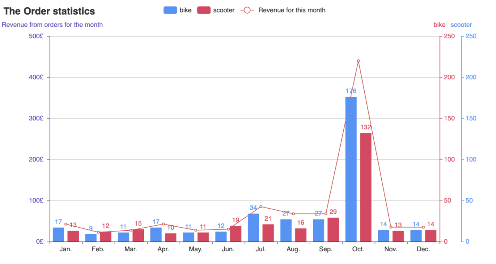
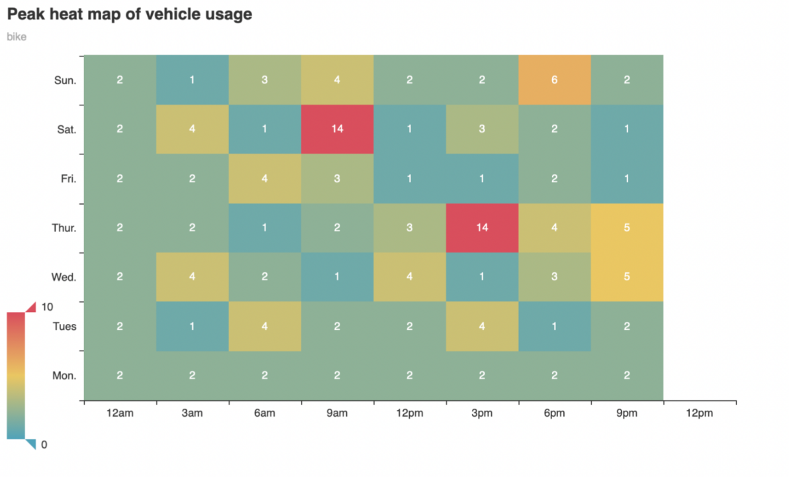
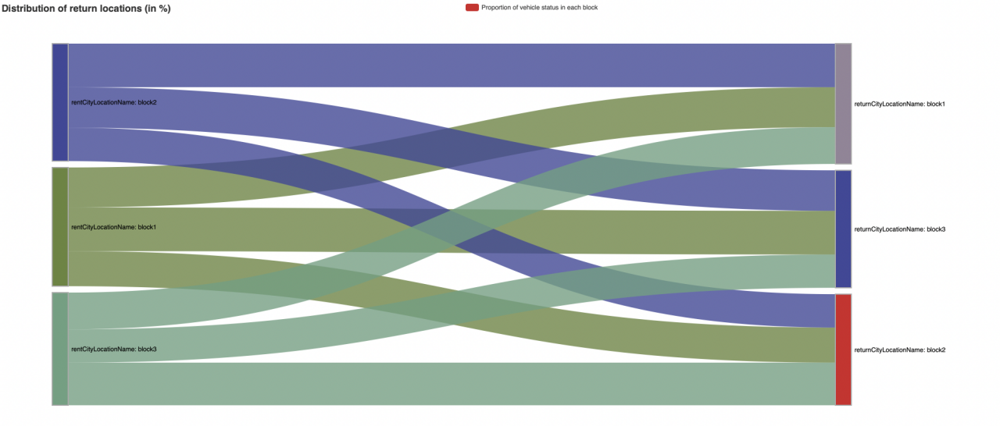
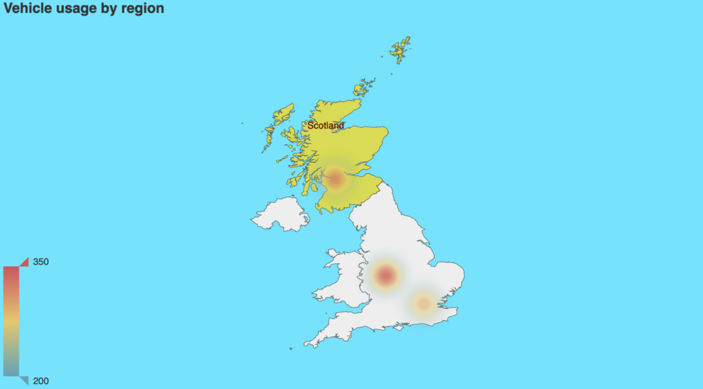
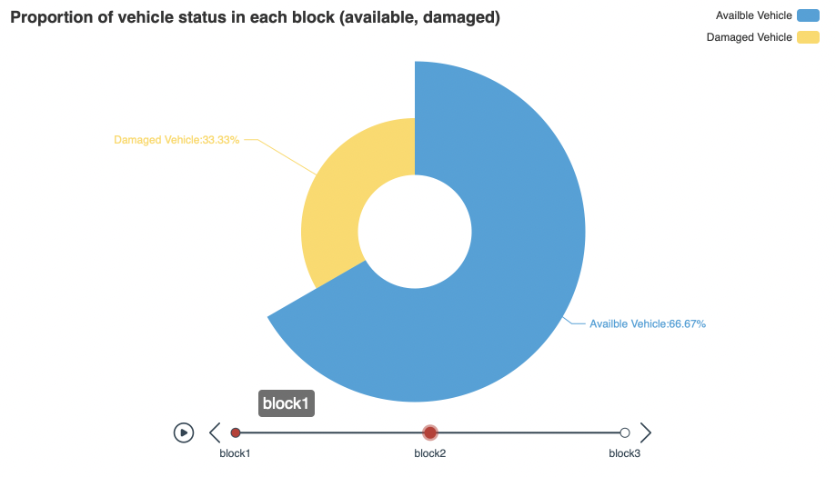

# bike_rent_StatisticVis

## PyeChart Data Visualization

In this project, we utilize [PyeChart](https://pyecharts.org/) for creating data visualization charts.

The following five images are static screenshots generated from HTML created by Pyecharts. You can download these images and interact with them.

1. image 1
  
   

     
   

- [Download the original HTML for image 1](image1.html)

2. image 2
  
   

     
   

- [Download the original HTML for image 2](image1.html)

3. image 3
  
   

     
   

- [Download the original HTML for image 3](image3.html)

4. image 4
  
   

     
   

- [Download the original HTML for image 4](image4.html)

5. image 5
  
   

     
   

- [Download the original HTML for image 5](image5.html)

You can click on the download links above for each image's original HTML to access the interactive versions that allow for changes.

